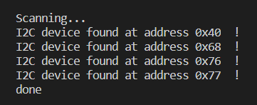
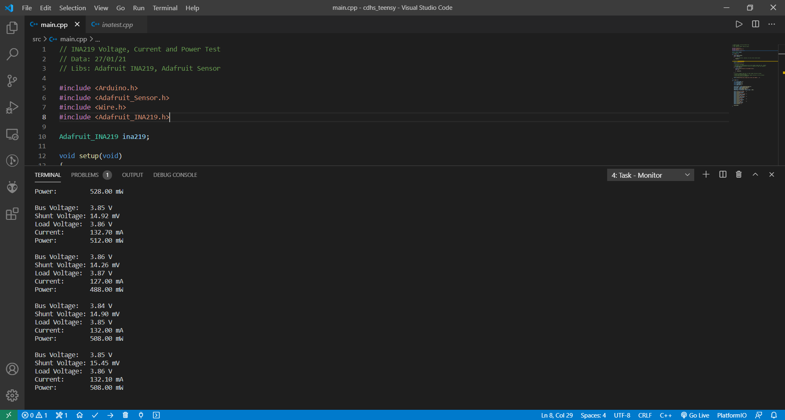
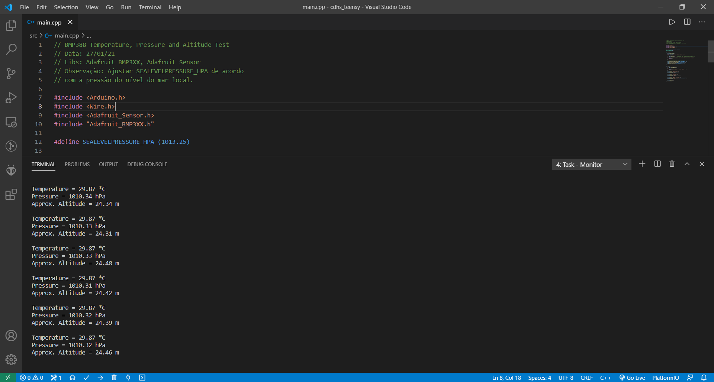
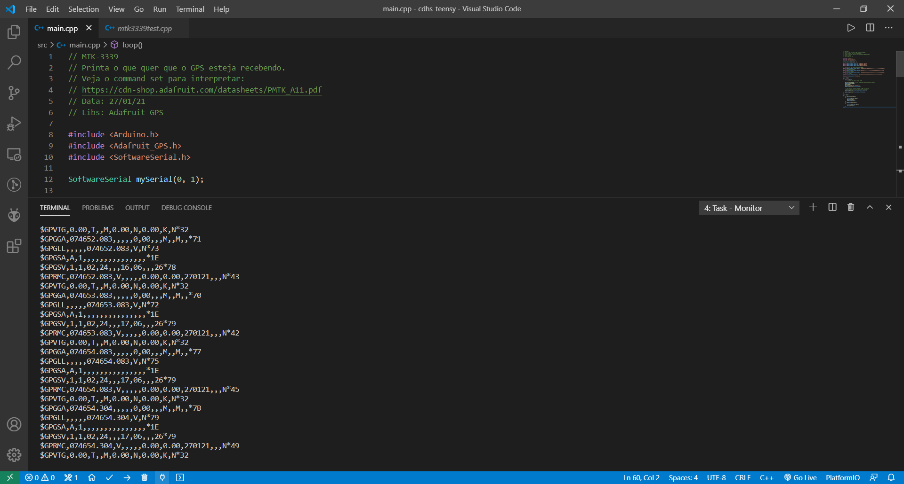
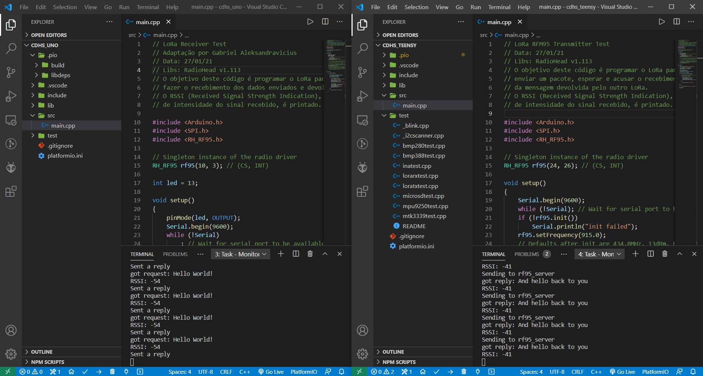
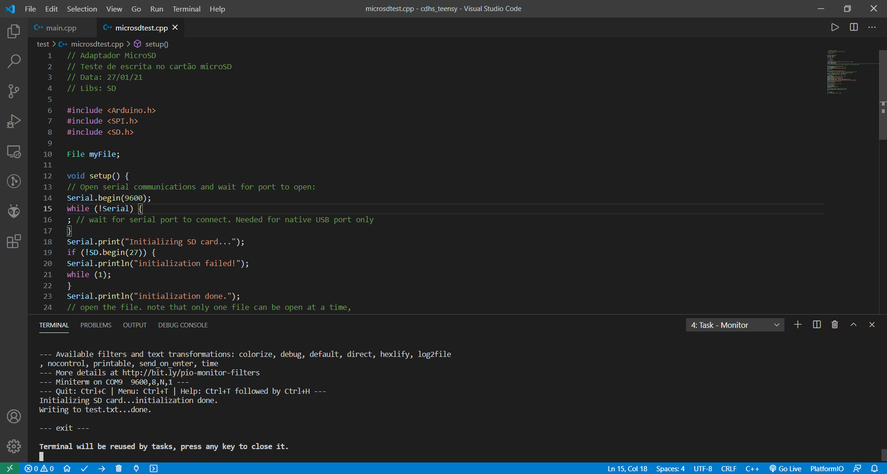
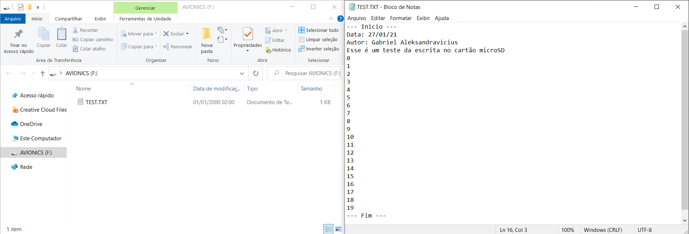

*Observação*: Todos os testes nos sensores do CDHS dependem da energia fornecida pelo EPS, por isso os testes com esses sensores estão sendo armazenados nesta página.

## Informações sobre os módulos
- INA219
    - Comunicação: I2C
    - Endereço: 0x40
    - Documentos: [Datasheet](https://www.ti.com/lit/ds/symlink/ina219.pdf)
    - Pinos: SCL, SDA

- BMP388
    - Comunicação: I2C
    - Endereço: 0x76 (SDO -> GND), **0x77** (SDO -> 3v3)  
    - Documentos: [Datasheet](https://www.mouser.com/pdfdocs/BST-BMP388-DS001-01.pdf), [Breakout Guide](https://learn.adafruit.com/adafruit-bmp388-bmp390-bmp3xx)
    - Pinos: SCL, SDA, SDO (HIGH)

- GY-91
    - Comunicação: I2C
    - Endereço:
        - MPU9250: **0x68** (SDO -> GND), 0x69 (SDO -> 3v3)
        - BMP280: **0x76** (SDO -> GND), 0x77 (SDO -> 3v3)
    - Documentos: [MPU9250](https://invensense.tdk.com/wp-content/uploads/2015/02/PS-MPU-9250A-01-v1.1.pdf) e [BMP280](https://cdn-shop.adafruit.com/datasheets/BST-BMP280-DS001-11.pdf) Datasheets
    - Pinos: SCL, SDA, SDO (LOW)

- MTK3339
    - Comunicação: Serial
    - Documentos: [Datasheet](https://cdn-shop.adafruit.com/datasheets/GlobalTop-FGPMMOPA6H-Datasheet-V0A.pdf), [Command Set](https://cdn-shop.adafruit.com/datasheets/PMTK_A11.pdf), [GPS Guide](https://www.adafruit.com/product/790)
    - Pinos: RX, TX

- LoRa RFM95W
    - Comunicação: SPI
    - Documentos: [Datasheet](https://www.hoperf.com/data/upload/portal/20190801/RFM96W-V2.0.pdf), [Breakout Guide](https://learn.adafruit.com/adafruit-rfm69hcw-and-rfm96-rfm95-rfm98-lora-packet-padio-breakouts/overview)
    - Pinos: MISO, MOSI, SCK, CS (24), RST (25), G0 (26)
    - Libs: [RadioHead](https://www.airspayce.com/mikem/arduino/RadioHead/classRH__RF95.html)

- MicroSD Adapter
    - Comunicação: SPI
    - Documentos: [Breakout Guide](https://learn.sparkfun.com/tutorials/microsd-breakout-with-level-shifter-hookup-guide?_ga=2.241187777.251676394.1611503180-1140351207.1611042160)
    - Pinos: MISO, MOSI, SCK, SC (27), CD (28)

*Obs: Nos módulos que possuem comunicação I2C, a opção em negrito simboliza o endereço escolhido.*

## Comunicação entre as placas
Na EPS foi verificado que os pinos de potência do barramento estavam recebendo a tensão correta. Porém, na comunicação com o flat cable foi percebido que as tensões não chegavam corretamente. Após uma análise foi percebido que o LM7805 estava mal-soldado. Após feita a correção, o problema foi corrigido.

## Testes nos módulos
No processo final de validação das placas é necessário testar todos os sensores individualmente na placa. O código utilizado para isso está documentado [aqui](/docs/aurorav2/software/testes).

### Endereços I2C
Usamos o I2C Scanner para identificar os endereços dos módulos I2C. Percebemos que temos 4 dispositivos. Na ordem: 0x40 (INA219), 0x68 (MPU-9250), 0x76 (BMP280), 0x77 (BMP388).

### INA219
O código de exemplo do INA219 nos forneceu a tensão das baterias, a corrente que atravessa o componente e a potência consumida pelo circuito.

### BMP388
O BMP388 possui funções capazes de nos fornecer dados de temperatura, pressão, altitude e outros dados. O código de teste printou na tela esses 3 dados. Devemos fornecer a pressão a nível do mar local na constante SEALEVELPRESSURE_HPA, pois ela é utilizada nos cálculos.

### GY-91
#### BMP280
O BMP280 é bem semelhante ao BMP388 nas suas capacidades. Também fornecemos a pressão a nível do mar local, dessa vez como parâmetro da função bmp.readAltitude(). Foi observada uma discrepância muito grande dos dados desse sensor em comparação aos do BMP388, muito embora a equação utilizada para definir a altitude seja idêntica nas duas situações. A origem dessa diferença está sendo investigada.

#### MPU-9250
O código de teste do MPU-9250 nos forneceu dados do acelerômetro, do giroscópio, do magnetômetro - todos esses em 3 eixos - e de temperatura. Há uma diferença considerável na temperatura percebida por esse sensor e as percebidas pelo BMP280 e BMP388. Uma diferença é esperada devido à imprecisão, porém está sob estudo como diminuir essa discrepância entre os sensores.

### MTK3339
O código de teste do GPS MTK3339 printa no terminal o que quer que o GPS esteja lendo naquele momento. 

### LoRa
O LoRa do CDHS foi validado a partir de um teste de envio e outro de recebimento de pacotes. O outro LoRa necessário foi montado com um Arduino Uno (como visto na imagem abaixo à esquerda).

Os dois testes foram bem sucedidos, provando que o LoRa do CDHS é capaz tanto de enviar quanto de receber pacotes a uma taxa altíssima.

Código utilizado para o receiver (esquerda) e transmitter (direita).

### MicroSD Adapter
O objetivo do teste com o adaptador do cartão microSD era comprovar que através dele nós somos capazes de acessar o cartão, escrever alguma coisa e salvar essa informação - o que de fato foi alcançado.

## Mudanças Necessárias
Conforme os testes foram sendo realizados, algumas mudanças foram percebidas como necessárias no circuito. As mudanças a serem feitas no Altium são:
- Trocar na Board (altium) os capacitores do EPS por eletrolíticos;
- Trocar alimentação do GY-91 do VIN para o 3V3; Prot:heavy_check_mark: Ofc:heavy_check_mark:
- Deixar apenas um resistor no SDA e outro no SCL, de preferência próximo à entrada dessas linhas no Teensy; Prot:heavy_check_mark: Ofc:heavy_check_mark:
- Trocar layer do SCK na entrada pro Teensy; Prot:heavy_check_mark: Ofc:heavy_check_mark:
- Trocar pino de SCK (SPI) para o pino 13; Prot:heavy_check_mark: Ofc:heavy_check_mark:
- Trocar pino do buzzer para o pino 32; Prot:heavy_check_mark: Ofc:heavy_check_mark:
- Colocar SDO do BMP388 no 3v3; Prot Ofc
- Colocar SDO do GY-91 no GND; Prot Ofc